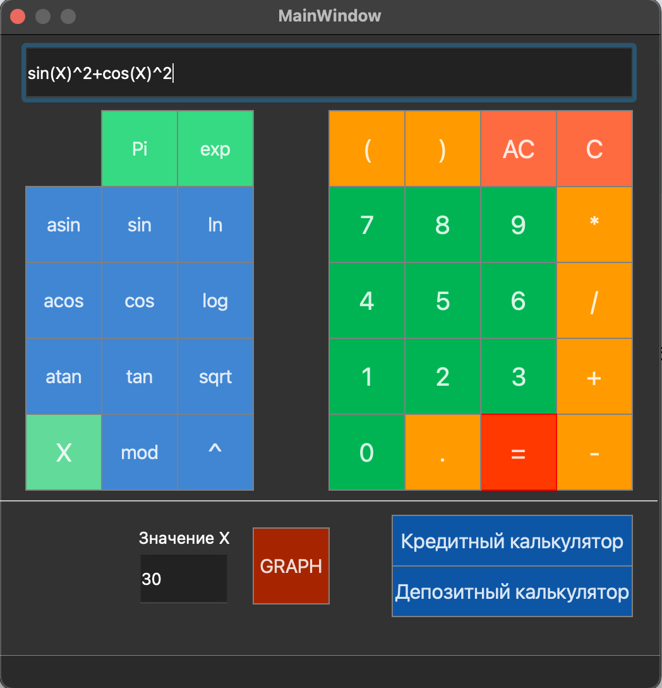
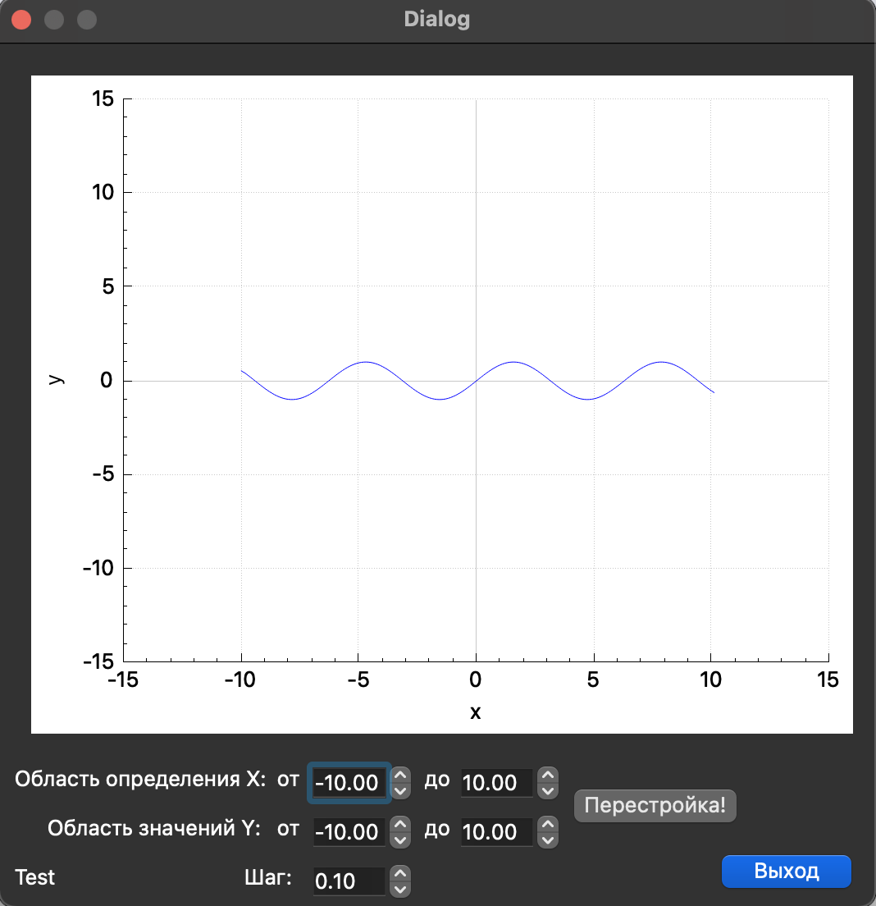
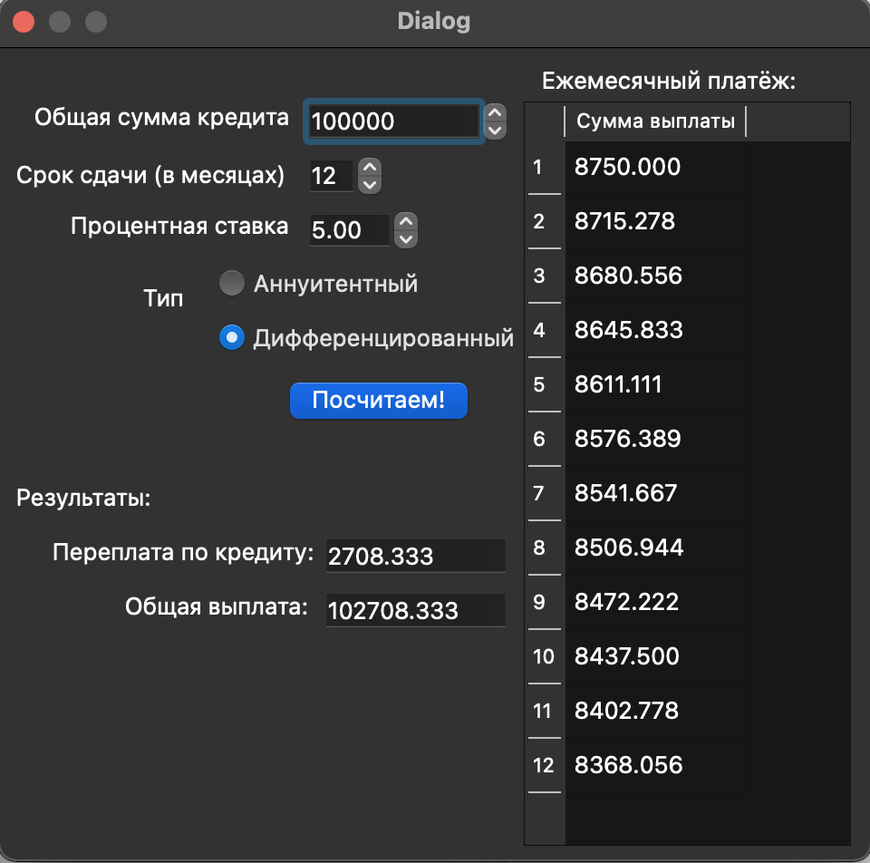
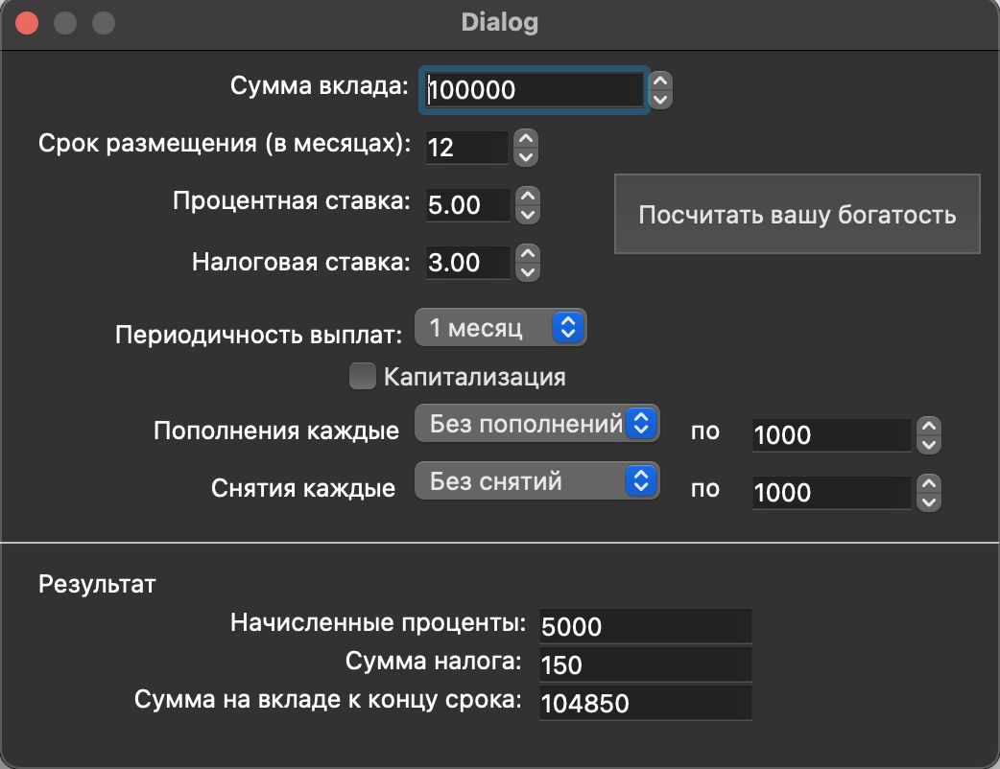

# SmartCalc v1.0
Realization of calculator in C and C++ languages using QT framework.  
Project date: 04-2023

## Project Build

The project is built with the `make` command in the `src` folder, there are the following targets:  
- `install` - install the application in the build folder,  
- `uninstall` - uninstallation,  
- `dvi` - opening help,  
- `dist` - archiving the project,  
- `gcov_report` - view test coverage (lcov utility is required),  
- `style` - converting code to clang-format style,  
- `check_style` - check code for style,  
- `valgrind` - check for leaks with valgrind utility,  
- `leaks` - check for leaks with the leaks utility on Mac OS,  
- `rebuild` - rebuild the project,  
- `clean` - clean the project from temporary files.

## Implementation of SmartCalc v1.0

- The program is developed in C11 standard C language using gcc compiler.
- The program assembly should be configured using Makefile with a standard set of targets for GNU programs: all, install, uninstall, clean, dvi, dist, test, gcov_report
- Provided unit-test coverage of modules related to expression evaluation using the Check library
- Implementation with GUI, based on any QT GUI library.
- Both integers and real numbers written through a dot can be fed to the program input
- Calculation is performed after fully entering the expression to be evaluated and pressing the `=` symbol.
- Calculating arbitrary bracketed arithmetic expressions in infix notation
- Calculation of arbitrary bracketed arithmetic expressions in infix notation with substitution of the _x_ variable value as a number.
- Plotting a graph of a function defined by an expression in infix notation with the _x_ variable (with coordinate axes, marking of the scale used and a grid with adaptive step).  
- Checkable accuracy of fractional part - 7 decimal places
- Ability to enter up to 255 characters
- Stapled arithmetic expressions in infix notation support the following arithmetic operations and math functions:
    - **Arithmetic operators**:

        | Operator name | Infix notation   (Classic) |
        | ------ | ------ | 
        | Brackets | (a + b) |
        | Adding | a + b |
        | Subtraction | a - b |
        | Multiplication | a * b |
        | Division | a / b |
        | Multiplication | a ^ b | a ^ b | 
        | Remainder of division | a mod b |
        | Unary plus | +a | 
        | Unary minus | -a |

    - **Functions**:
  
        | Function Description | Function | 
        | ---------------- | ------- |  
        | Calculates cosine | cos(x) |   
        | Calculates sine | sin(x) |  
        | Calculates tangent | tan(x) |  
        | Calculates arccosine | acos(x) | 
        | Calculates arcsine | asin(x) | 
        | Calculates the arctangent | atan(x) |
        | Calculates the square root | sqrt(x) |
        | Calculates the natural logarithm | ln(x) | 
        | Calculates the decimal logarithm | log(x) |

## Credit calculator

Special mode "credit calculator":
 - Input: total loan amount, term, interest rate, type (annuity, differentiated)
 - Output: monthly payment, loan overpayment, total repayment

## Deposit calculator

Special mode "deposit yield calculator":
 - Input: deposit amount, deposit term, interest rate, tax rate, payment frequency, interest capitalization, list of replenishments, list of partial withdrawals
 - Exit: accrued interest, tax amount, amount on deposit by the end of the term.

 ## Screenshots

   
   
   
 