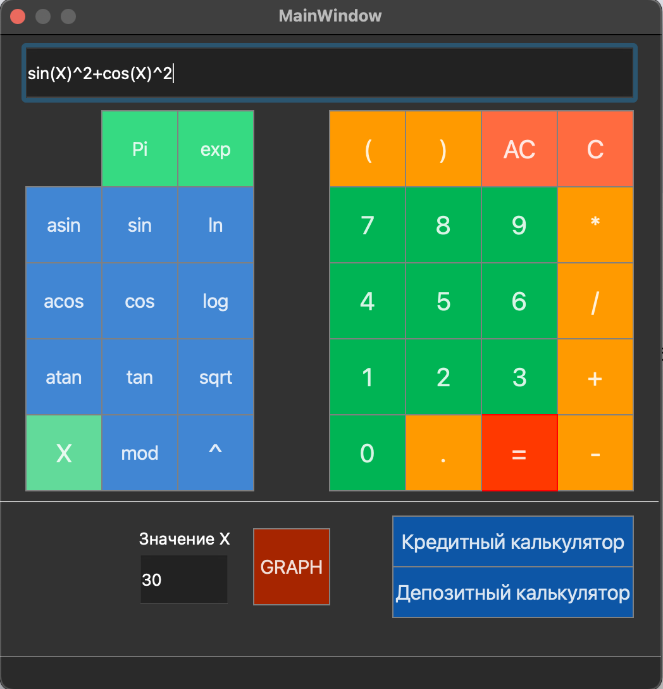
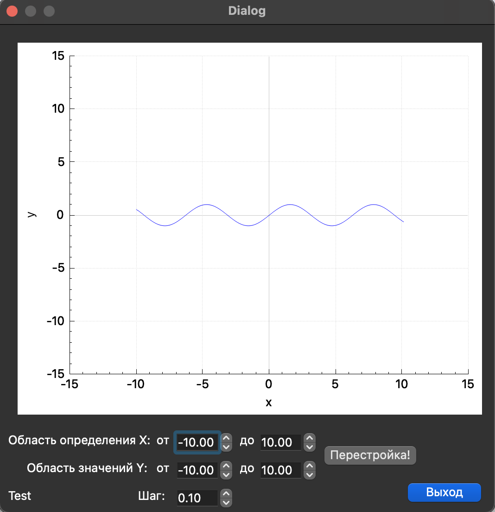

# SmartCalc v1.0
Реализация калькулятора на языках C и C++ с использованием фреймворка QT.  
Project date: 04-2023

## Project Build

Сборка проекта осуществляется командой `make` в папке `src`, существуют следующие цели:  
- `install` - установка приложения в папку build,  
- `uninstall` - деинсталляция,  
- `dvi` - открытие справки,  
- `dist` - архивирование проекта,  
- `gcov_report` - просмотр покрытия тестов (необходима утилита lcov),  
- `style` - приведение кода к стилю clang-format,  
- `check_style` - проверка кода на стиль,  
- `valgrind` - проверка на утечки утилитой valgrind,  
- `leaks` - проверка на утечки утилитой leaks на Mac OS,  
- `rebuild` - пересобрать проект,  
- `clean` - очистить проект от временных файлов.

## Реализация SmartCalc v1.0

- Программа разработана на языке Си стандарта C11 с использованием компилятора gcc.
- Сборка программы должна настроена с помощью Makefile со стандартным набором целей для GNU-программ: all, install, uninstall, clean, dvi, dist, test, gcov_report
- Обеспечено покрытие unit-тестами модулей, связанных с вычислением выражений, с помощью библиотеки Check
- Реализация с графическим пользовательским интерфейсом, на базе любой GUI-библиотеки QT
- На вход программы могут подаваться как целые числа, так и вещественные числа, записанные через точку
- Вычисление производится после полного ввода вычисляемого выражения и нажатия на символ `=`
- Вычисление произвольных скобочных арифметических выражений в инфиксной нотации
- Вычисление произвольных скобочных арифметических выражений в инфиксной нотации с подстановкой значения переменной _x_ в виде числа
- Построение графика функции, заданной с помощью выражения в инфиксной нотации с переменной _x_  (с координатными осями, отметкой используемого масштаба и сеткой с адаптивным шагом)  
- Для вычисления используется алгоритм приведения к польской нотации
- Проверяемая точность дробной части - 7 знаков после запятой
- Возможность ввода до 255 символов
- Скобочные арифметические выражения в инфиксной нотации поддерживают следующие арифметические операции и математические функции:
    - **Арифметические операторы**:

        | Название оператора | Инфиксная нотация   (Классическая) | 
        | ------ | ------ | 
        | Скобки | (a + b) |
        | Сложение | a + b |
        | Вычитание | a - b |
        | Умножение | a * b |
        | Деление | a / b |
        | Возведение в степень | a ^ b | 
        | Остаток от деления | a mod b |
        | Унарный плюс | +a | 
        | Унарный минус | -a |

    - **Функции**:
  
        | Описание функции | Функция |   
        | ---------------- | ------- |  
        | Вычисляет косинус | cos(x) |   
        | Вычисляет синус | sin(x) |  
        | Вычисляет тангенс | tan(x) |  
        | Вычисляет арккосинус | acos(x) | 
        | Вычисляет арксинус | asin(x) | 
        | Вычисляет арктангенс | atan(x) |
        | Вычисляет квадратный корень | sqrt(x) |
        | Вычисляет натуральный логарифм | ln(x) | 
        | Вычисляет десятичный логарифм | log(x) |

## Кредитный калькулятор

Специальный режим "кредитный калькулятор":
 - Вход: общая сумма кредита, срок, процентная ставка, тип (аннуитетный, дифференцированный)
 - Выход: ежемесячный платеж, переплата по кредиту, общая выплата

## Депозитный калькулятор

Специальный режим "калькулятор доходности вкладов":
 - Вход: сумма вклада, срок размещения, процентная ставка, налоговая ставка, периодичность выплат, капитализация процентов, список пополнений, список частичных снятий
 - Выход: начисленные проценты, сумма налога, сумма на вкладе к концу срока

 ## Скриншоты

   
   
   
 
